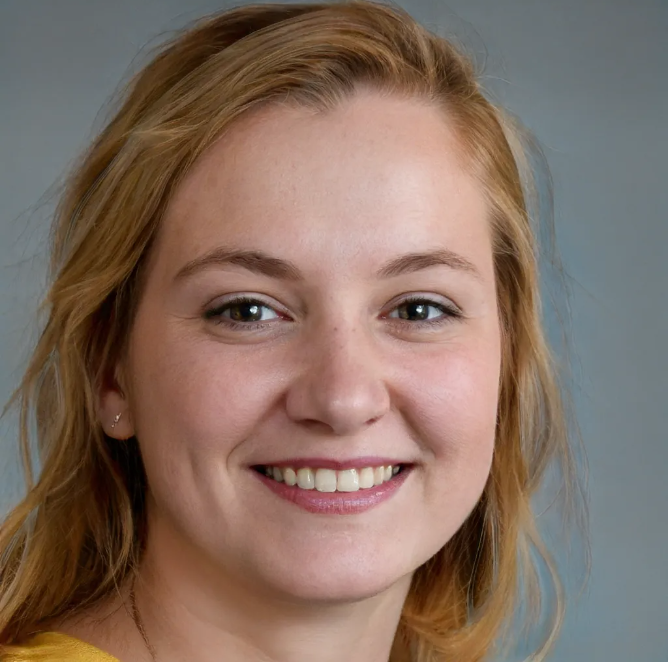
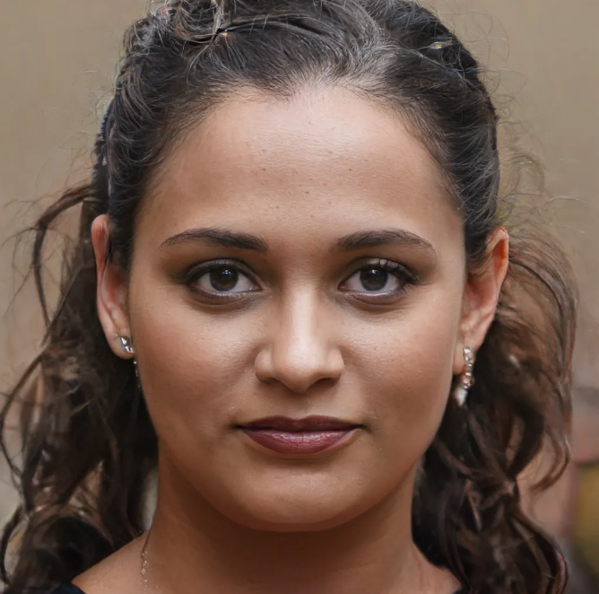

# Personas

As personas são utilizadas para ter uma representatividade de qual o público alvo que o projeto pretende atingir. Assim fica claro quais os requisitos que o projeto deve cumprir para satisfazer a necessidade dessa persona.

## Jéssica Plats

| Status          | Persona Primária |
| --------------- | ---------------- |
| Idade           | 23 anos |
| Profissão       | Estudante de engenharia de software |
| Escolaridade    | Ensino superior incompleto |
| Habilidades     | Extrovertida e criativa |
| Relacionamentos | Mora com os pais e é muito próxima dos 2 irmãos |
| Expectativas | Conhecer novas pessoas e criar meu primeiro jogo em time |
| Objetivos | Entrar no mercado de jogos com um bom conhecimento em desenvolvimento de jogos |

## Quotis Johnson

| Status          | Persona Primária |
| --------------- | ---------------- |
| Idade           | 38 anos |
| Profissão       | CEO de uma empresa de jogos |
| Escolaridade    | Bacharelado em Ciência da Computação |
| Habilidades     | Proativo e empreendedor |
| Relacionamentos | Casado e com um cachorro |
| Expectativas | Conhecer novas pessoas e criar meu primeiro jogo em time |
| Objetivos | Conhecer e incentivar novas pessoas para o mercado de jogos |

## Rafael José

| Status          | Persona Primária |
| --------------- | ---------------- |
| Idade           | 24 anos |
| Profissão       | Estudante de engenharia de software no campus gama |
| Escolaridade    | Ensino superior incompleto |
| Habilidades     | criativo e observador |
| Relacionamentos | Mora com a mãe e encontra toda semana com os irmãos |
| Expectativas | Que o projeto da Game Jam perdure e continue dentro da universidade |
| Objetivos | Realizar a Game Jam e retirar dados para estudos do efeito para o conhecimento |

## Allan Ricardo

| Status          | Persona Primária |
| --------------- | ---------------- |
| Idade           | 21 anos |
| Profissão       | Estudante de ciência da computação no campus Darcy Ribeiro |
| Escolaridade    | Ensino superior incompleto |
| Habilidades     | Dedicado e leal |
| Relacionamentos | Mora com a mãe, irmãos e tem 7 gatos |
| Expectativas | Aplicar o conhecimento e desenvolver um jogo com seu time |
| Objetivos | Participar da Game Jam e adquirir conhecimento para aplicação em outras áreas |

## Andressa Joana

| Status          | Persona Primária |
| --------------- | ---------------- |
| Idade           | 30 anos |
| Profissão       | Advogada |
| Escolaridade    | Bacharelado em direito |
| Habilidades     | Focada e esforçada |
| Relacionamentos | Mora com seu marido e tem um filho |
| Expectativas | Nenhuma relacionada ao contexto |
| Objetivos | Nenhum relacionado ao contexto |

## Bibliografia

BARBOSA S. D. J.; SILVA B. S. Interação Humano-Computador ed. Elsevier, 2010.